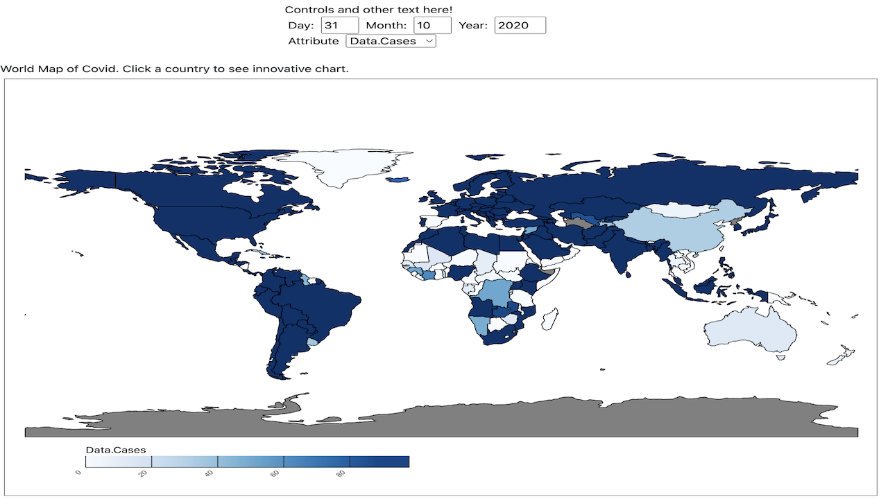
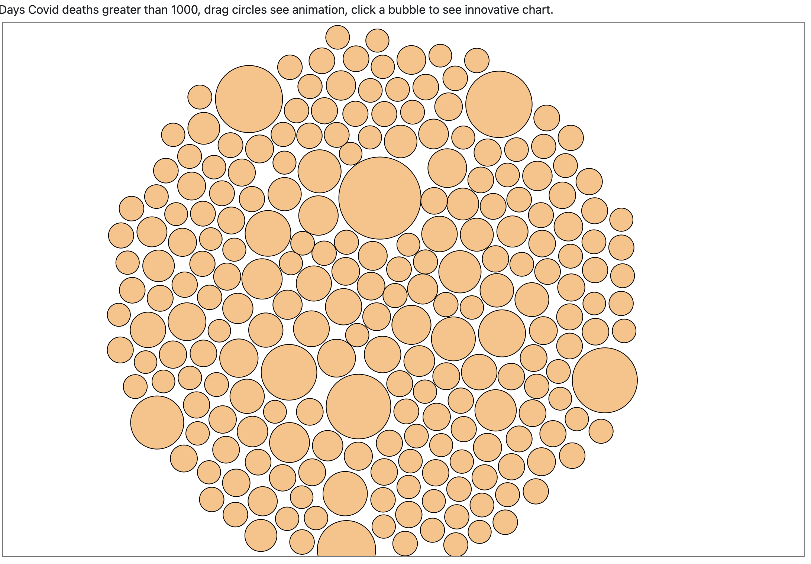
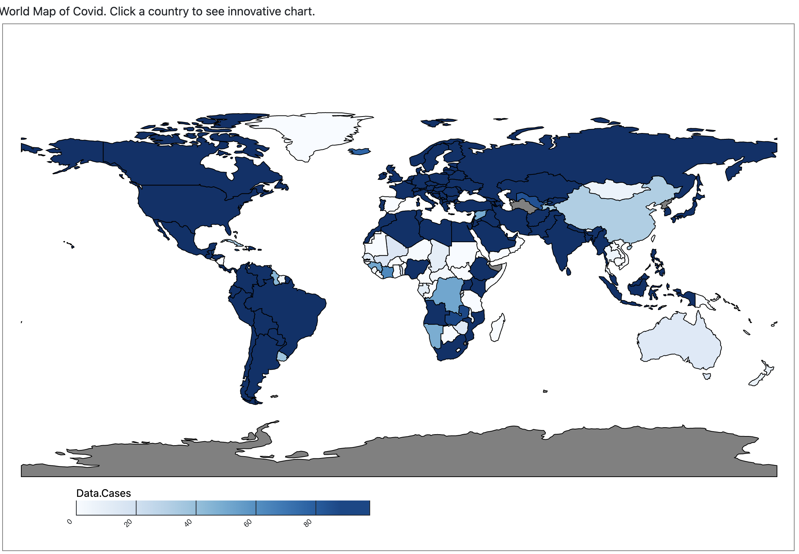
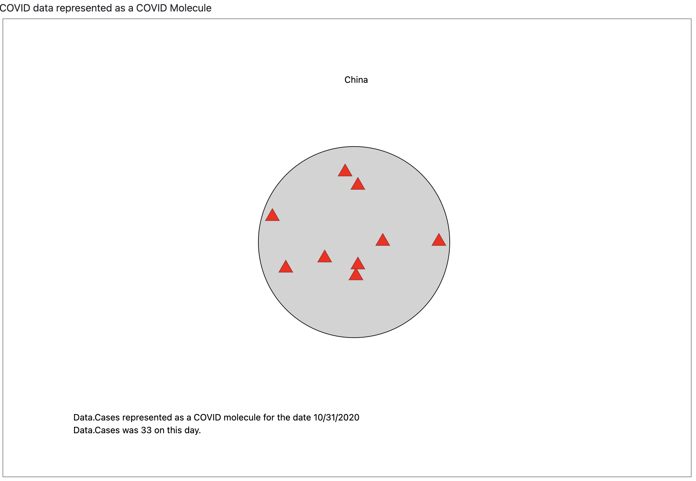

## CSE494 - Final Project

## Team Members:

- Rachel White, rcwhite1@asu.edu, 1000785567
- Boon Yeow Koh, bkoh2@asu.edu, 1213002425
- Birong Yang, byang53@asu.edu, 1215301269

## Overview

Our project will be utilizing the COVID dataset from CORGIS (https://corgis-edu.github.io/corgis/csv/covid/). The plan is to create a map of the world, which can be used as a choropleth map to show the density of COVID in various counties at various points in time. Selecting countries from the map can trigger the drawing of other charts and visualizations.

The CORGIS data contains information on new COVID cases and deaths by country by day, month, and year. It also contains information on the population of the country in 2019, and the cumulative number of cases reported for 14 days per 100,000 people (the rate of COVID’s spread). The information on countries will be used in drawing the map, while the other information will inform the choropleth map and any other visualizations we include.

## Data Description

Data Type: This dataset is a form of tables that are made up of columns and rows. This dataset is a simple flat table and the column represents the attributes and the row represents each item. It includes day, month, year, cases, deaths, country, location code, population, and continent.
Dataset availability: static
Attribute Type: Year and month are sequential, quantitative ordered attributes. The country is also ordered by alphabet. The name of the continent and location code are categorical attributes since they are unordered. The population and deaths are unordered quantitative attributes. There are a total of 9 attributes
Cardinality: The years are from 2019 to 2020.
Variables intend to visualize: we will create a map visualization and use a tooltip to visualize. When the mouse hovers over each country, the number of deaths
Scale: There are 214 countries and 53630 rows of data for our COVID-19 dataset

## Goals and Tasks

Our goal is to create 4 charts to analyze covid-19 cases and deaths and to compare it with other countries.

Tasks:
Identify: We can identify the covid cases and death by looking the position of the dots on the scatterplot. If the dot is on the top right corner, it means the country has high covid cases and deaths.
Lookup: The user can look up the number of deaths of each country by clicking on teh country on the map and seeing how many red spikes there are on the covid molecule chart.
Sort: The countries on the scatterplot are sorted by the number of cases and deaths. Countries with more cases and death are positioned in the top right corner.
Compare: We can compare the number of cases by comparing the color of the countries in the map. the darker the country, the more cases there are.

## Idioms

We represented the data using 4 different chart. The map chart, innovative covid molecule chart, scatterplot chart, and the circle chart. We have also designed widgets to change the date, which will update the chart.

- In our Circle Chart, we have animation and show when death cases reach and above 1000 and add the tooltip to show countries of each circle represented, and circles that have the highest death cases will have larger size of radius. The purpose of displaying the circle chart is to compare the deaths from covid with other countries using the size of the circle. Also when the cicle of a country is clicked, it will update the covid molecule chart to shows the number of deaths on the molecule. We also used the forceStimulation() function to allow the circles to move around and be dragged as well as the join function to bring the circles together.

- In the scatterplot chart, each dot represents a country. The horizontal position of the dot represent the number of cases and the vertical position of the represents the number of deaths. Countries with high covid cases and deaths are at the top right position and countries with low covid cases and deaths are in the bottom left position. When the scatterplot is clicked, it will update the covic molecule chart to show the specific countries Covid statistics. To draw the scatter plot, I used scaleLinear() to create and x and y scales and used the append function to add the circles representing each country on to the chart

- In the map chart, the currently selected attribute and day are displayed as a choropleth global map. The menus at the top control which day and attribute data are displayed. When the map of a country is clicked it will update the covid molecule chart. To draw the map, the javascript uses a geojson file to draw the countries. The name of each country and the currently selected day are then cross-referenced with the COVID dataset to extract the desired value, which is represented on the map as the color of the country.

- In the COVID molecule chart, the user can select a country on the map chart to display the currently selected attributes in an alternate rendering as as COVID molecule's spike proteins (the triangular or bulbous projections that cover the surface of a COVID molecule). In order to represent the spike proteins, we look up the value of the desired attribute in the COVID dataset for the selected day. This value is then scaled linearly in order to reduce it to a reasonable number of triangles to draw. Then, for each triangle, we generate a random x and y position in order to overlay it neatly on the circle that forms the body of the COVID molecule.

## Reflection

Initial we wanted to create a bar chart and lollipop chart to analyze COVID-19. When we met with the proffessor, the professor said that our charts were similar and he suggested we should make a molecule chart that resembles the shape of a COVID-19 virus and have spikes within the molecule to represent the number of deaths in the country. This was a big challenge for us as there was no sample code available to refer unlike the other charts. However we were able to overcome this challenge after researching on how to design and add our own shapes with data. Also we switch our a lollipop chart with a circle chart to represent the deaths of each country compared with eaach other. After meeting with the professor again to present our demo, the professor suggested that we should link all of our charts, which we were able to implement.

## Teamwork

Boon Yeow was in charge of making the scatterplot and the readme write up. Rachel was in charge of designing the map chart and the covid chart. Birong was in charge of designing the molecule chart and linking the charts together.
